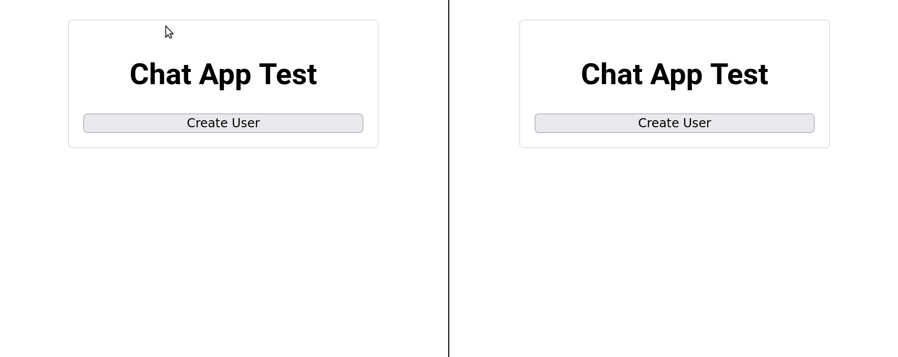

# Demo chat application using Next.js

Written as an experiment to see how easy it is to create a proof-of-concept
chat application. Not attempting to be production ready or follow best practices. 

Design goals:
- Use Next.js
- Real-time notification of new messages (using websockets)
- Simple user management system (automatic user creation on login, identity stored on encrypted cookie)

Technology:
- [`nextjs`](https://nextjs.org/)
- [`iron-session`](https://github.com/vvo/iron-session)
- [Prisma ORM](https://www.prisma.io/)
- [socket.io](https://socket.io/)

## Running in dev mode

Install dependencies: `npm ci`

Initialize database: `npx prisma migrate dev`

Start websockets server: `npm run dev:wss`

Start next.js server: `npm run dev:next`

Then go to `http://localhost:3000` using two different browser sessions
